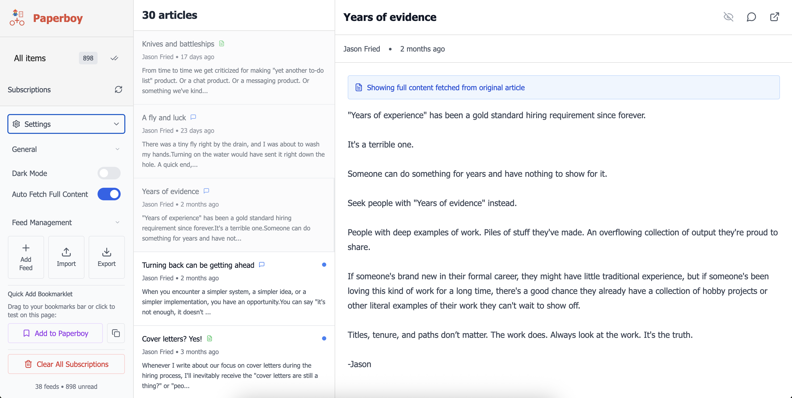
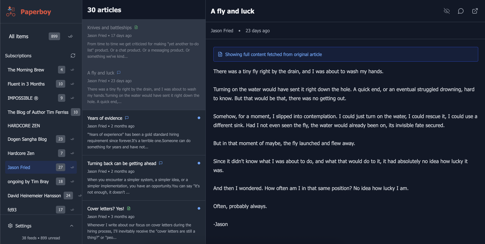

<div align="center">
  
  
  # Paperboy

  *A modern RSS reader built with Next.js, TypeScript, and SQLite, inspired by Google Reader's clean interface.*

</div>

## Why create this?
This project scratches two itches, how much can you vibe code apps using cursor and getting something up and running and also showing some love to the old internet of the RSS era where we had lots of little blogs not eaten up by big tech.


## Screenshots

<table>
  <tr>
    <td>
      
      <p align="center"><em>Light mode with settings panel</em></p>
    </td>
    <td>
      
      <p align="center"><em>Dark mode interface</em></p>
    </td>
  </tr>
</table>

## Features

- 📖 **Clean Google Reader-inspired UI** - Three-panel layout with sidebar, article list, and content view
- 🌙 **Dark/Light Mode** - Toggle between light and dark themes with system preference detection
- 🗄️ **SQLite Database** - Local storage using Prisma ORM for feeds and articles
- 🔄 **Automatic Updates** - Background refresh of feeds with manual refresh option
- ✅ **Read/Unread Tracking** - Mark articles as read/unread with visual indicators
- ⚙️ **Settings Panel** - Configurable options including auto-fetch content and theme preferences
- 📱 **Responsive Design** - Works well on desktop and mobile devices
- 🎨 **Tailwind CSS** - Modern styling with typography support for article content
- 🔖 **OPML Support** - Import/export feed subscriptions in standard OPML format
- 🚀 **URL Routing** - Deep linking to specific feeds and articles with browser back/forward support

## Getting Started

1. **Install dependencies:**
   ```bash
   npm install
   ```

2. **Set up the database:**
   ```bash
   npx prisma migrate dev --name init
   ```

3. **Start the development server:**
   ```bash
   npm run dev
   ```

4. **Open your browser:**
   Navigate to [http://localhost:3000](http://localhost:3000)

## Usage

### Adding Feeds

**Individual Feeds:**
1. Click on "Feed Management" at the bottom of the sidebar to expand it
2. Click "Add Feed" button
3. Enter the RSS feed URL in the form that appears
4. Click "Add Feed" to subscribe

**Bulk Import (OPML):**
1. Click on "Feed Management" at the bottom of the sidebar to expand it
2. Click the "Import" button
3. Select an OPML (.opml) or XML (.xml) file
4. The app will automatically import all feeds from the file
5. You'll see toast notifications showing the import progress and results

### Reading Articles
1. Select a feed from the sidebar (or "All items" for everything)
2. Click on an article in the middle panel to read it
3. Articles are automatically marked as read when opened
4. Use the eye icon to toggle read/unread status

### Mark All as Read
- **For all articles**: Click the double-check icon (✓✓) next to "All items" to mark all unread articles as read
- **For specific feeds**: Click the double-check icon next to any feed name to mark all articles in that feed as read
- These buttons only appear when there are unread articles

### Exporting Subscriptions
1. Click on "Feed Management" at the bottom of the sidebar to expand it
2. Click the "Export" button
3. This downloads an OPML file containing all your feeds
4. The file can be imported into other RSS readers or re-imported later as a backup

### Refreshing Feeds
- Click the refresh icon in the sidebar to manually update all feeds
- Feeds are automatically updated every 30 minutes in production

## API Routes

- `GET /api/feeds` - Get all feeds with unread counts
- `POST /api/feeds` - Add a new feed
- `POST /api/feeds/update` - Update all feeds
- `POST /api/feeds/[id]/mark-read` - Mark all articles in a specific feed as read
- `POST /api/feeds/import-opml` - Import feeds from OPML file
- `GET /api/feeds/export-opml` - Export feeds as OPML file
- `GET /api/articles` - Get articles (optionally filtered by feed)
- `POST /api/articles/[id]/read` - Mark article as read
- `DELETE /api/articles/[id]/read` - Mark article as unread
- `POST /api/articles/mark-all-read` - Mark all articles as read

## Tech Stack

- **Frontend:** Next.js 14, React, TypeScript
- **Styling:** Tailwind CSS with Typography plugin
- **Database:** SQLite with Prisma ORM
- **RSS Parsing:** rss-parser
- **OPML Processing:** xml2js
- **Icons:** Lucide React
- **Date Handling:** date-fns

## Database Schema

- **Feeds:** Store RSS feed information (title, URL, description)
- **Articles:** Store individual articles with read status
- **User Preferences:** Store app settings and preferences

## Development

### Building for Production
```bash
npm run build
npm start
```

### Linting
```bash
npm run lint
```

### Database Management
```bash
# View database
npx prisma studio

# Reset database
npx prisma migrate reset

# Generate Prisma client
npx prisma generate
```

## Project Structure

```
src/
├── app/                 # Next.js App Router
│   ├── api/            # API routes
│   ├── globals.css     # Global styles
│   ├── layout.tsx      # Root layout
│   └── page.tsx        # Home page
├── components/         # React components
│   ├── ArticleContent.tsx
│   ├── ArticleList.tsx
│   ├── RSSReader.tsx
│   ├── Sidebar.tsx
│   └── Toast.tsx       # Toast notification system
└── lib/                # Utilities
    ├── db.ts           # Database connection
    ├── feed-updater.ts # Background job system
    ├── opml-parser.ts  # OPML import/export logic
    └── rss-parser.ts   # RSS parsing logic
```

## Version Control

The project includes a comprehensive `.gitignore` file that excludes:
- Dependencies (`node_modules/`)
- Build outputs (`.next/`, `out/`)
- Environment variables (`.env*`)
- Database files (`*.db`, `prisma/dev.db*`)
- Database migrations (`prisma/migrations/`)
- IDE/Editor files (`.vscode/`, `.idea/`)
- OS generated files (`.DS_Store`, `Thumbs.db`)
- Log files (`*.log`)
- Cache files and temporary directories

## License

This project is open source and available under the MIT License.
